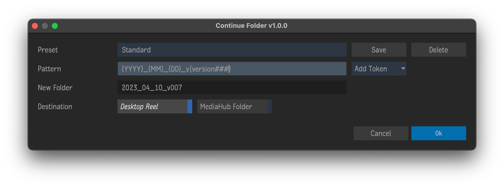

# Continue Folder

Plugin for [Autodesk Flame software](http://www.autodesk.com/products/flame).

Create a new reel on the Desktop and/or a system folder in MediaHub Files using tokens.

## Tokens
- `AM/PM`
- `am/pm`
- `Day`
- `Hour (12hr)`
- `Hour (24hr)`
- `Minute`
- `Month`
- `Version`
	- Scan the other folders present and if found, will increment to the new version number.  *Similar* to the version token for pattern browsing.
    - Use optional hashes for padding.  `{version###}`
- `Year`

## Example Workflow
You want to have a Library that will mirror a folder of exports on the server:
 1. Navigate to the filesystem folder of exports
 2. Select the folder `->` right click `->` Create... `->` Continue Folder
 3. Create a Desktop Reel that follows the preferred naming convention
 4. Copy your clips for export to this new Desktop Reel
 5. Drag this reel to the Library of exports
 6. Finally, drag the reel from the Library of exports into the MediaHub Files section to create a folder with the same name as the reel containing your clips

## Installation
**Tested & working on 2021.1 & 2024 PR180**

To make available to all users on the workstation, copy `continue_folder.py` to `/opt/Autodesk/shared/python`

For specific users, copy to `/opt/Autodesk/user/<user name>/python`

## Menus
- Right-click selected folders in a MediaHub Files `->` Create... `->` Continue Folder

## Acknowledgements
UI Templates courtesy of [pyflame.com](http://www.pyflame.com)
